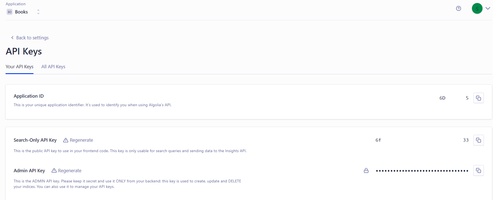

# Collaborative Filtering

A recommendation technique used in recommendation systems to provide personalized suggestions to users based on their past interactions and behaviors. It relies on the idea that users who have agreed on various items in the past are likely to agree again in the future.


<details>
<summary style="font-size: 20px;">Dependencies</summary>
To install the required Python packages you can use the following command:

```bash
pip install -r requirements.txt
```
</details>

<details>
<summary style="font-size: 20px;">Datasets Reference</summary>
This dataset has been compiled by Cai-Nicolas Ziegler in 2004, and it comprises of three tables for users, books, and ratings.

Explicit ratings are expressed on a scale from 1-10 (higher values denoting higher appreciation) and implicit rating is expressed by 0.
</details>

<details>
<summary style="font-size: 20px;">Collaborative Filtering Recommendation Model</summary>

Step 1: Collect Datasets
- `Books.csv`: Information about books.
- `Users.csv`: User data with user IDs.
- `Ratings.csv`: User-book interaction data with user ratings.

Step 2: Data Preprocessing
- Handle missing values, if any.
- Ensure data consistency and accuracy.
- Remove duplicates and irrelevant columns.

Step 3:  Popularity-Based Recommendation
- Calculate popularity scores for books

Step 4: Implement Collaborative Filtering Recommendation
- Compute user similarities based on past interactions.
- Identify similar users for each target user.
- Recommend books based on similar users preferences using cosine vector similarity
<p align="center">
  
</p>

Step 6: Demo Showcase
- Showcase the collaborative filtering recommendation system demo in flask application
</details>

<details>
<summary style="font-size: 20px;">Run <i>model.ipynb</i></summary>
Generate all the binary pkl and csv files needed to run the demo showcase
</details>

<details>
<summary style="font-size: 20px;">Edit <i>api.py</i> [Optional for Search funtion]</summary>
  
- Create an account at <a href=https://www.algolia.com/users/sign_in>Algolia</a>
- Create your index and upload records of filtered 'BooksDataset.csv'
- Find your API and edit on api.py
<p align="center">
  
</p>

```
# Algolia API search

ALGOLIA_APP_ID = '____________'
ALGOLIA_API_KEY = '______________________'
ALGOLIA_INDEX_NAME = '_______________________'
```

</details>

<details>
<summary style="font-size: 20px;">Run <i>app.py</i></summary>
✨ Enjoy the demo
</details>

<hr>

<footer>
  Feel free to send issues if you face any problem. </br>
  ✨ Don't forget to star the repo :)
</footer>
